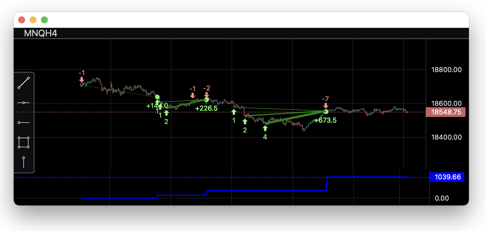

# Visualise your trades using Trading View Charts and Python



[Article on Medium](https://medium.com/@rozdol/visualise-your-trades-using-tradingview-charts-and-python-55a2b1808695)

Install packages:

```bash
pip install openpyxl lightweight_charts pandas numpy
```

Run the script:

```bash
python analysis.py
```